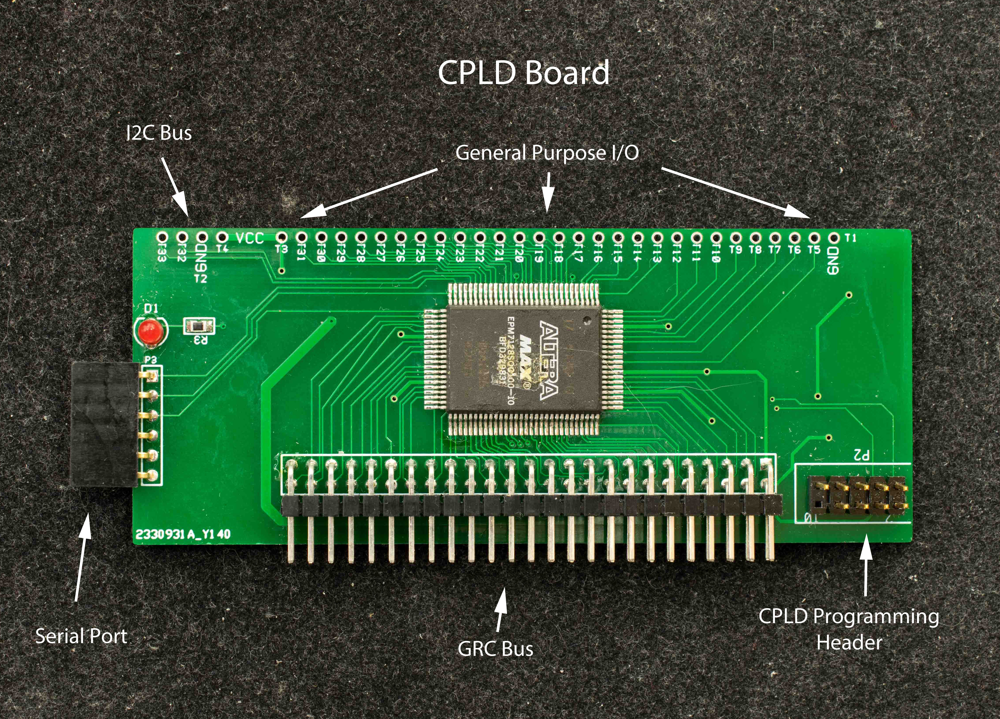

# GRC CPLD Module
CPLD board is the heart of the GRC. A minimum PRCC is consists of a CPLD board and a processor board. CPLD contains a simple bootstrap ROM, an internal serial port, and necessary decoding logic to interface to the specific processor and control the RAM and compact flash drive. The CPLD serves as the diagnostic module when bringing up a GRC system initially.

### Design Information
- Schematic
- Gerber photoplots
- Bill of Materials

### CPLD design files
- CPLD for Z80
- CPLD for 6502
- CPLD for 68008
