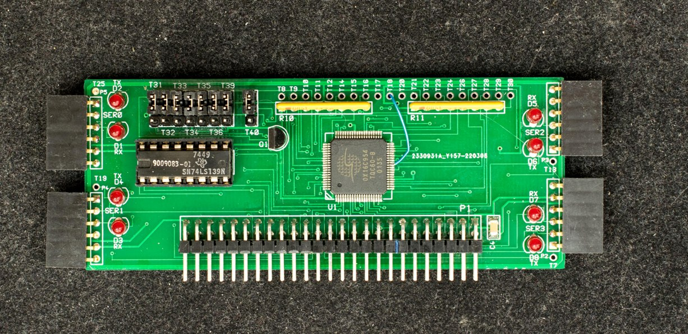
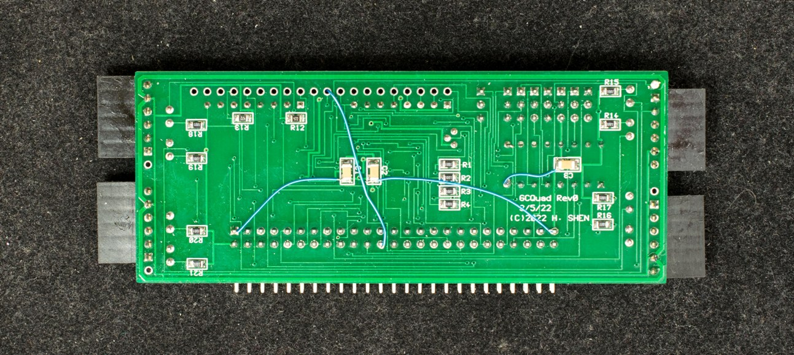

# Rev0 Engineering changes
There are two problems with the Quad Serial board. The first one is missing write strobe connection. This was due to a faulty library component for the newly created grc bus connector. The second problem is ground; OX16C954 is fairly fast so needs good ground. I added 3 extra ground wires but a better solution is 4-layer pc board with dedicated power and ground planes.

