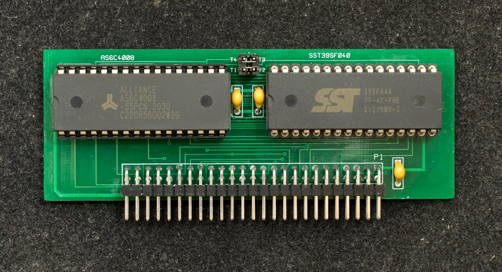

# RAM Flash Module
RAM/Flash module is the only memory in the system. It consists of a 512K flash memory and a 512K RAM memory. The flash can be reconfigured as a 512K RAM making it a full megabyte board. Both RAM and flash are divided into multiple 32KB bank for most 8-bit processors. There are 4 bank registers on the CPLD that can be controlled under software. For processors with larger than 64K memory space such as Z180, Z280, and 68008, processors have direct control of the RAM's address lines.

### Design files
- [Schematic](GCR_rev1_scm.pdf)
- Gerber photoplots
- Bill of Materials
