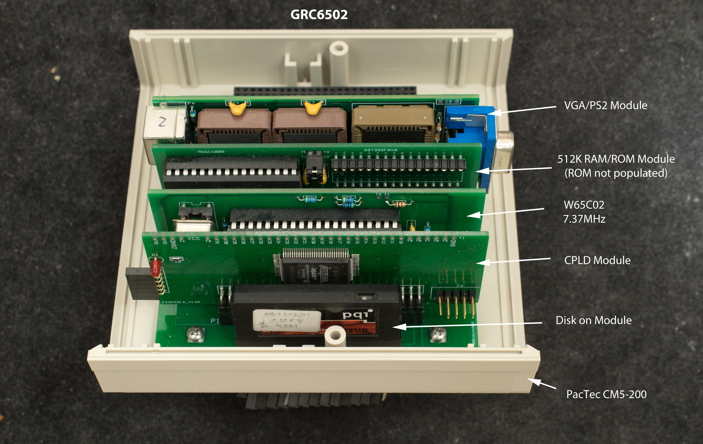
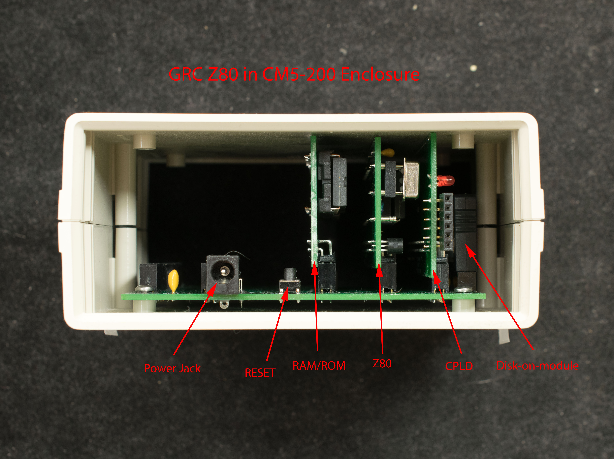

# GRC
Generic Retro Computer (GRC) is a modular system for 8-bit (and some 16-bit) processors of 1970's and 1980's. The processor can be Z80, 8085, 6809, 6502, 68008, and other 5-volt, 8-bit processors or 16-bit processors with 8-bit bus. The processor shares the same hardware resources of CPLD, RAM, and CF disk.

